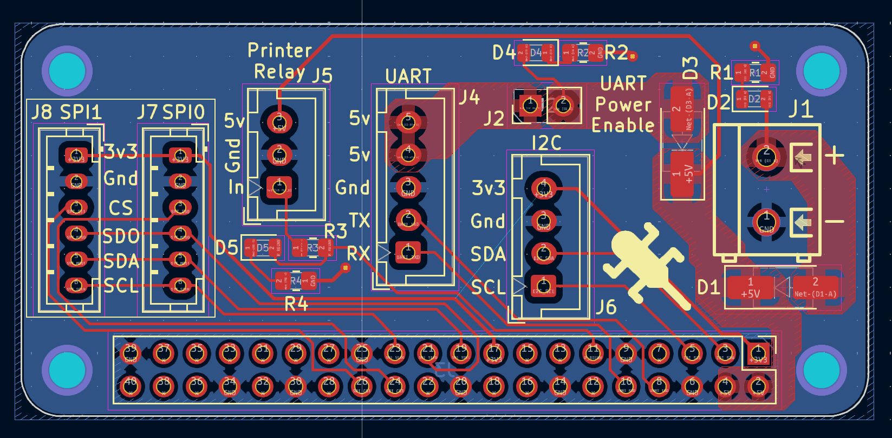

A simple break-out board for a Raspberry Pi that makes accessing some GPIO interfaces easier for [klipper](https://www.klipper3d.org/).

## Features
5V Power in via screw terminal for powering Pi.

UART Bus for connecting klipper directly to a control board via serial.  
The UART bus also has 2 pins for 5V, which depending on your control board can power the Pi (In my case, the [SKR-Pico](https://github.com/bigtreetech/SKR-Pico) supports this). This can be enabled using the `UART Power Enable` jumper.

Reverse current protection on both power inputs, also doubling as Power Or-ing, allowing both power inputs to be powered simultaniously safely.

LED indicators on each power input to indicate when each one is powered.

SPI bus split into 2 connectors with different CS pins (`spi0: GPIO8`, `spi1: GPIO7`), for screens and ADXLs.

I2C bus for miscellaneous purposes.

A header for connecting to a Relay Module to toggle power to the actual printer, uses `GPIO17`.  
Also features an LED to indicate when the relay is toggled.
